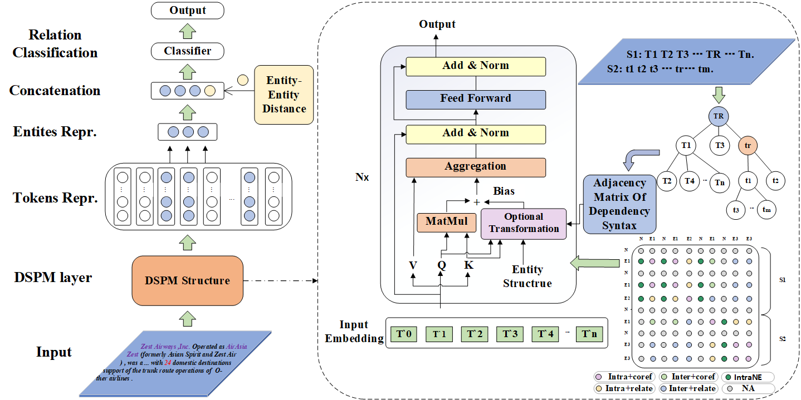

# DSPM
## Introduction
This is the pytorch implementation of the **DSPM** model.
**We propose a DSPM model (a pretraining model guided by dependency syntax information in alternative ways)** for document-level relation extraction tasks.
This model effectively integrates dependency syntax information into
BERT to improve its ability to process long texts by enhancing attention between two tokens with dependencies
in a sentence. 
Specially, a dependency syntax tree is built at the document level, and three different alternative (Direct Transformation, Biaffine Transformation, Decomposed Linear Transformation) fusion methods are
designed to fuse the dependency syntax information into the pretraining model.

This implementation is adapted based on [huggingface transformers](https://github.com/huggingface/transformers).
<div  align="center">  

</div>  


## Requirements
 * python3.7.0, transformers==2.7.0  
 * This implementation is tested on a single 10G 3080 GPU with CUDA version=11.0.


## Prepare Model and Dataset
 - Download pretrained models into `./pretrained_lm`.
For example, if you want to reproduce the results based on RoBERTa Base, you can download and keep the model files as:
```
    pretrained_lm
    └─── roberta_base
         ├── pytorch_model.bin
         ├── vocab.json
         ├── config.json
         └── merges.txt
```
Note that these files should correspond to huggingface transformers of version 2.7.0.
Or the code will automatically download from s3 into your `--cache_dir`.

 - Download [DocRED dataset](https://drive.google.com/drive/folders/1c5-0YwnoJx8NS6CV2f-NoTHR__BdkNqw) into `./data`, including `train_annotated.json`, `dev.json` and `test.json`. Moreover, the adjacency matrix corresponding to the document-level dependency syntax tree for each dataset, i.e. the data in data.rar, can be unpacked into `./data`. 


## Train
 - Choose your model and config the script:  
Choose `--model_type` from `[roberta, bert]`.
 - Then run training script:
 
```
sh train.sh
```  
checkpoints will be saved into `./checkpoints`, and the best threshold for relation prediction will be searched on dev set and printed when evaluation.


## Predict
Set `--checkpoint` and `--predict_thresh` then run script:  
```
sh predict.sh
```
The result will be saved as `${checkpoint}/result.json`.  
You can compress and upload it to the official competition leaderboard at [CodaLab](https://competitions.codalab.org/competitions/20717#results).
```
zip result.zip result.json
```
